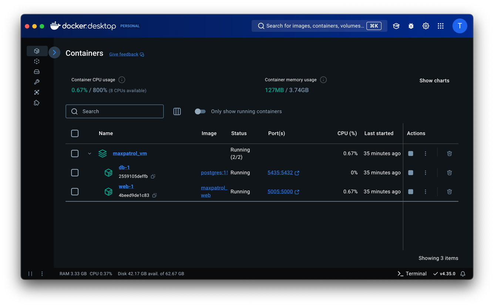

# maxpatrol vm с нуля

# Запуск

- Склонировать проект
- Запустить из папки `maxpatrol/`

```shell
docker-compose up --build
```

# Описание

Данная програма, подключается по SSH к хосту и собирает информацию о нём. После, эту информацию записывает в БД

**Профиль сканирования**: логин, пароль, порт, ip\
**Tранспорт**: ssh

**Функционал**:
- Лог запущенных команд
- Детект Debian, Ubuntu, Manjaro, Unknown Linux
- Заполнение основных сведений об ОС: 
  - `ОС`
  - `версия`
  - `архитектура`

## Стэк
**База данных**: `Postgres`\
**Flask** - ui interface\
**SQLAlchemy** - Работа с Postgresql\
**logging** - Логирование\
**paramiko** - Работа с удалёнными хостами
**Docker**: проект развёрнут в докер контейнерах\


## Использование

После создания контейнеров web интерфейс доступен по адресу:
- http://localhost:5005 
- http://127.0.0.1:5005


Переходим и видим главную страницу

Вбиваем данные и нажимаем `Start Scan`

После видим окно с выводом информации о сканировании


Чтобы вернуться к начальной странице и проделать сканирование ещё раз или посмотреть базу данных, нажмём `Start Next Scan`

Не заполнив всю форму невозможно продолжить


Посмотрим Базу данных (Нажмём `Show Database`)

&nbsp;&nbsp;&nbsp;&nbsp;&nbsp; Эта табличка реализована так, что скролинг происходит только наполнения таблицы, сами заголовки неподвижны.

Так же реализовано окно ошибок


##  Логирование

Реализовано при помощи библиотеки logging.

Происходит логирование следующим образом:
- При запуск программы инициализируются классы Logger для каждого класса (SSH, DB, UI)
- При инициализации создаётся папка logs, она создаётся на том же уровне, что и src 
  - В logs создаются папки для каждого класса (SSH, DB, UI)
  - В каждой папке создаётся файл для логирования


- Все выполненные команды на удалённой машине логируются в SSH


## ! `.env` !

Так как это тестовый проект, я прикрепил сюда тестовые данные бд в файле `.env` 

> **В реальных продуктах это делать нельзя, `.env` добавляется в `.gitignore`**

